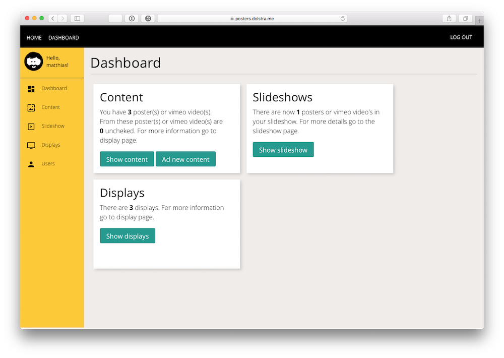
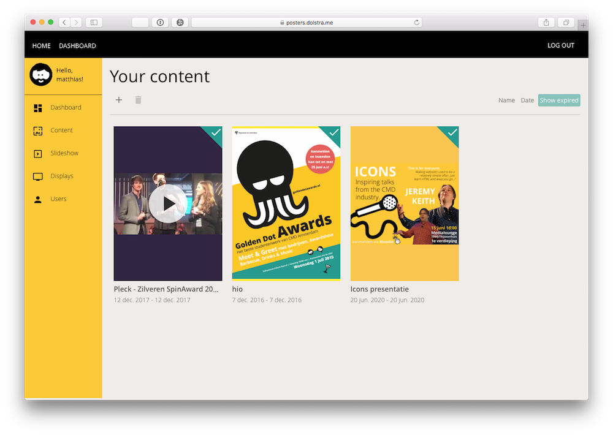
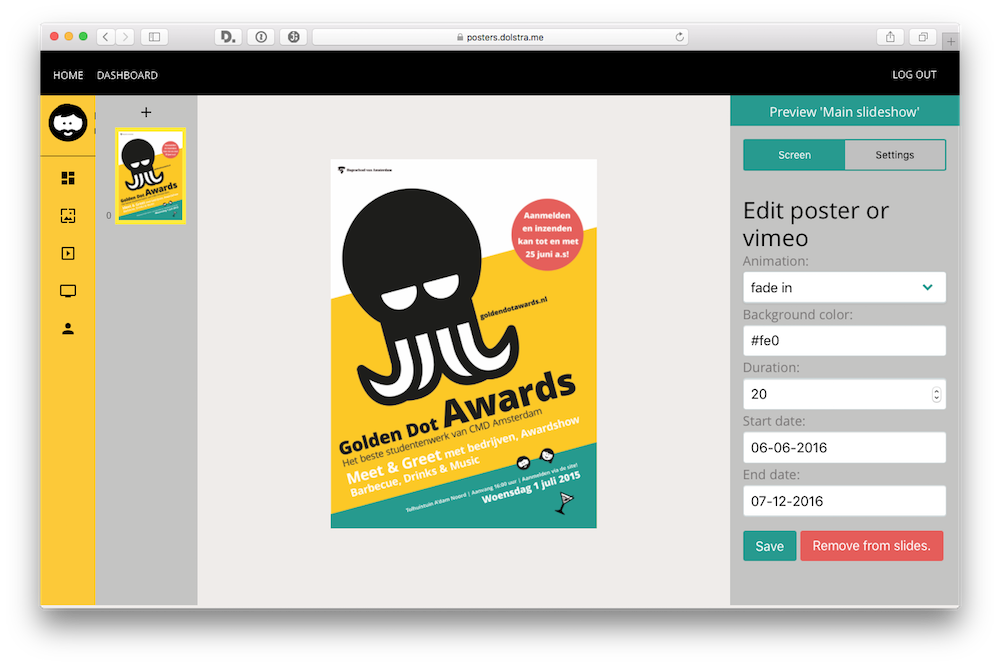
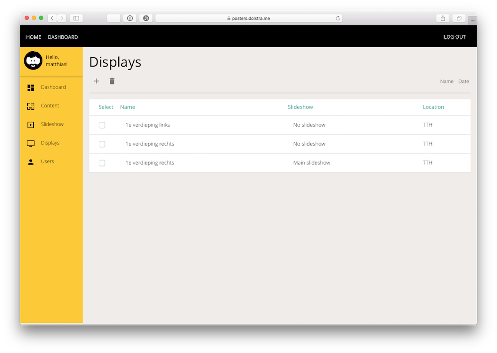

# MeesterProef CMD screens Content

   

## Live url
[https://posters.dolstra.me](https://posters.dolstra.me)

## Synopsis
A CMS to upload posters of Vimeo movies and show them on a screen.

## Motivation
The university of Amsterdam needs an application for displaying posters on screens. They are using A0 posters now. But there are too few places for all students to show their poster. Now they have asked to create a CMS for uploading the posters and editing them in a slideshow

## Installation

Download: [https://github.com/mat1th/meesterproef.git](https://github.com/mat1th/meesterproef.git)

Go to the project:

```bash
cd path/to/files
```

Install node modules:

```bash
npm install
```

## Setting things up
Before you can start the application you need to connect to the database. And you need to setup the mail part of the application.

### Connect to the database
Please duplicate ```config/config_example.json``` and rename the file to ```config/config.json```. In this file you define all the passwords form the app and the database connections. The variables in the ``all`` section are available in each environment.

An example setting block:
```json
"development": {
    "env": "development",
    "dbOptions": {
        "host": "host",
        "user": "user",
        "password": "ww",
        "database": "database",
        "port": 10000
    }
}
```
You van create as mutch environment as you want. To use a stage duplicate ```config/config_example.js``` and rename the file to ```config/config.js```. This this file will be used for selecting the environment. Replace the string on the first row with the environment you want to use.

```js
var env = process.env.NODE_ENV || 'development'
```

### Add database structure
Now we have got to set up the database structure. In the file ``database/database.sql`` can you find the  database structure. Please add it to your database. Now you can build the app.

## Building

Install Gulp:

```bash
npm install --global gulp-cli
```

Go to the project:

```bash
cd path/to/files
```

Install dev npm modules:

```bash
npm install --dev
```

### For the first time you need to run:

```bash
gulp build
```
This conferts all the images and place the other files from the ```public/src``` to the ```public/dist``` folder. Then you can start the browser-sync task to run browser sync with nodemon to auto refresh the browser.

Start Gulp for browser sync:

```bash
gulp browser-sync
```

### Code structure
In the app.js file, you can find the start file from the app. For every route is a file in the route folder. The files are so structured that the path of the file is the path of the URL.

```
/config                //the config of the application
/lib
  /hbsHelper.js        //the hbs template helpers
  /socketConnection.js //connection to the socket
/modules               //all the modules from the app
/public
  /src
    /img               //all the images if the application
    /js
    /css
/routes     
  /admin               //the admin part of the application (for all these routes you need to be logged in)
  /api                 //The API that can be used in the front end
  /display             //the display route that will be shown on a display
  /middleware          //the middleware for the routes
  /users               //to log in and register the users
/sessions              //in this folder the sessions files will be saved
/uploads               //in this folder the uploaded files will be saved
/views                 //all the views of the application. It is structured the same as the routes in the routes folder
app.js                 //the root of the application. This file you need to start.

```

## Features from subjects
In this section I will tell witch things I've learned in the subjects an I've implemented.

### Web App from Scratch
#### IFFE
The client side application part is structured in Modules. Every part of the code is in an IFFE. That is an  Immediately-Invoked Function Expression. Only the parts that will be used outside the function will be returned. This is safer than open functions. A hacker can't get access to the other functions in the IFEE. And because the code is modular I could use it in another application.

#### Functional animations with hardware accelerated properties
With CSS keyframes, you can animate a lot of properties, but the most of them are not hardware accelerated. The most used hardware accelerated CSS properties are:
- opacity
- transform: rotate
- transform: scale
- transform: translate
- filter

In my animations in the application, I only use these properties.

#### Gestures
I've used a drag gesture to create a better experience with the slideshow editor. This is a self-written gesture.

#### Get and Post data with AJAX
On the slideshow page, the application gets and sends requests to the server. So the user can edit the order of the posters. The function is located in the ```public/src/js/app/DPhelper.js``` file.

#### Server-side templating
On the server the application uses HBS, a server-side variant of Handlebars, to render the pages. Everytime the app needs to render a page the function in the ```modules/renderTemplate.js``` file will be called. This function sets all the vars and parse them to HBS.

### CSS To The Rescue
#### Flexbox
The application is fully written with flexbox. For the other browsers, there is a fallback. You can see the fallback file in ```public/src/css/layout/fallbackflexbox.css```.

#### Special CSS
The elements in the banner on the home page has a vertical center. And manny other elements in the application. There are also transitions on hover. So the color of the poster preview transitions to dark on a hover. The cursor will be on hinting on elements if you can use them or not. And for mobile devices, I've extended the clickable area so It's easier to touch on these elements. The checkboxes, selects and options elements in the app are also custom. On the home page, I've used ::before and ::after elements to show the timeline interface.

### Performance Matters
#### CSS
On the first load of the application, all the CSS will be in the head of the body. (I can use this because the CSS file is only 91Kb) So the first render will be very fast. After this render, the CSS file will load with loadCSS. After the load of this CSS, there will be a cookie set with the value ```"style=true"```. If this cookie is in the request of the page it won't give the inline CSS. Now it gives a ``` <link rel="stylesheet" href="/css/style.css">```.

#### Gulp
The app is using gulp to minify the CSS, JS, and the images. The images on the home page are responsive images. So the browser chooses the right size for the screen.
```html
<picture class="">
  <source srcset="/img/home/step1-1500.png" media="(min-width: 1500w)" />
  <source srcset="/img/home/step1-1280.png" media="(min-width: 1280w)" />
  <source srcset="/img/home/step1-960.png" media="(min-width: 960w)" />
  <source srcset="/img/home/step1-960.png" media="(min-width: 640w)" />
  <source srcset="/img/home/step1-480.png" media="(min-width: 480w)" />
  
</picture>
```
### Optimized CSS and HTML
All CSS selectors are not longer than 3 deep. So the render engine is fast with parsing the css. The HTML is semantic an the classes and id's are nicely chosen.

#### Service Worker
If a browser supports a service Worker it will cache several pages. So the load times of the page will be a lot faster.

#### Progressive web app
The application is a progressive web app. I've created a ``manifest.json`` file so the Android phone knows witch icons the app should use. Combined with the Service Worker the app could use offline to view the app.

### Browser Technologies
#### Images
All the images have an alt tag, so the blind people know what kind of image it is. If the images aren't shown because the user has slow internet the alt tag will show up.

#### Icons
The icons are SVG so if the user has a font blocker or has slow internet the icons will appear. If the there is only an icon used for a button there is a title used for the blind people. The app uses inline SVGs with a fallback to a png image.

#### Accessibility
The whole app can be used by bad vision people the contrasts of the app are big enough the see the difference between the colors. The whole app can use with the tab key. So, for example, the advanced users of the blind people can use the app.
#### Voice over
The whole application can be used with voice over. I've tested it with Firefox, Safari, and Vivaldi.

#### Bandwith and privacy
The most actions of the application are server side. So a user with low bandwidth can also use the app. The site uses HTTPS so the 'free' hotspots can't insert code to show adds on the site.

#### Feature detection
The client-side JS is written that the most code can be used by old browsers. I've used ```document.getElementByID()``` on paces where I could use it. So the older browsers also can use the JS enhances.

#### Old browsers and slow internet
The application is built on the 3 layers: HTML, CSS & JS. The application is build with HTML5 elements. These elements are backward compatible. The old browsers that don't support these elements will create an unknown element, but the website doesn't break. The website will also work without client-side JS. So the application will work in older browsers or with slow internet.

### Real-time web
I haven't used meteor to create a realtime web app, but I've used a socket.io for live reloading the slideshow. If a user adds a new poster or Vimeo to the slideshow the slideshow will reload.

### Extra features
I've used some extra features in my application. Such as MySQL, emailjs, hsb, momentjs and right roles. I didn't follow the 'databases' course, but I would like to learn MySQL. So I've used MySQL in my application to learn. Now I've learned the most MySQL functions. And I've worked with the raspberry pi. This is a low power mini computer. I've installed the Chromium browser on it and edited the boot files, so it automatically opens the browser on the slideshow page. 

## Screenshots
### home page

### Dashboard page


### Content page


### Slideshow page

### Displays page



## NPM packages
Name                 | Version | Description
:------------------- | :------ | :----------
bluebird             | 3.4.1   | Full featured Promises/A+ implementation with exceptionally good performance
cookie-parser        | 1.4.3   | cookie parsing with signatures
emailjs              | 1.0.5   | send text/HTML emails and attachments (files, streams and strings) from node.js to any smtp server
express              | 4.13.4  | Fast, unopinionated, minimalist web framework
multer               | 1.1.0   | Middleware for handling <code>multipart/form-data</code>.
express-myconnection | 1.0.4   | Connect/Express middleware that auto provides mysql connections.
express-session      | 1.10.1  | Simple session middleware for Express
gsap                 | 1.18.5  | Think of GSAP as the Swiss Army Knife of animation...but better. It animates anything JavaScript can touch (CSS properties, canvas library objects, SVG, generic objects, whatever) and it solves countless browser inconsistencies, all with blazing speed (up
hbs                  | 1.18.2  | Express.js template engine plugin for Handlebars
MySQL                | 2.5.4   | A node.js driver for MySQL. It is written in JavaScript, does not require compiling, and is 100% MIT licensed.
body-parser          | 1.10.1  | Node.js body parsing middleware
moment               | 2.9.0   | Parse, validate, manipulate, and display dates
session-file-store   | 0.0.2   | Session file store is a provision for storing session data in the session file
socket.io            | 1.4.6   | Node.js realtime framework server

## Upcoming features
There are many things to do. Here a feature list with features that could be implemented.

- [x] Better performance on slower devices see [#50](https://github.com/mat1th/meesterproef/issues/50).
- [ ] Ability to delete posters, users, and displays.
- [ ] A set up wizard.
- [ ] Ability to edit a poster start and end date on the poster detail page.
- [ ] Translate the app to dutch.
- [ ] Logged-in variant of the home page.
- [ ] Ability to change your password.
- [ ] Ability to add a profile photo to an account. [#33](https://github.com/mat1th/meesterproef/issues/33)
- [ ] Ability to turn of a display (or go on black).
- [ ] Ability to upload videos from your mobile phone. (not Vimeo, normal mp4 videos ).
- [ ] Optimize uploaded images. So there will be a height resolution, small preview, and a bigger preview.
- [ ] Ability to filter the content on the content page, display page, and user page on name and date.

## Bugs to fix
- [ ] On old browsers the 'home' button in the menu will sign out the user.
- [ ] Make the slideshow editor work on older browsers that don't support draggable.
- [ ] Don't show the added posters in the picker on the slideshow edit page.

## Contributing
The Master branch is the branch where the final features are pushed to. The [master-v0.5](https://github.com/mat1th/meesterproef/tree/master-v0.5) branch is the old master branch with the old interaction.

### What to do
- Check out the latest master to make sure the feature hasn't been implemented or the bug hasn't been fixed yet.
- Check out the issue tracker to make sure someone already hasn't requested it and/or contributed it.
- Fork the project.
- Start a feature/bugfix branch.
- Commit and push until you are happy with your contribution.
- Make sure to add tests for it. This is important so we don't break it in a future version unintentionally.

### CSS syntax
For CSS I'm using [cssnext](http://cssnext.io). With this plugin, you can use the CSS syntax that will be supported later by the browsers.

### JS syntax
I'm using some new JS functions with Babel this will be converted to code that can be used by older browsers.

## Contributors
- [Mat1th](https://github.com/mat1th)
- [joostf](https://github.com/joostf)

## License

This code is published under Apache License.
